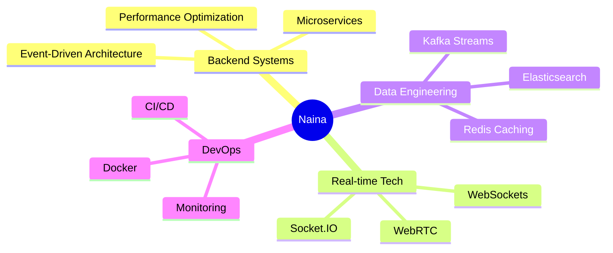

<div align="center">

<!-- Animated Header with Typing Effect -->


<!-- Snake eating contributions -->
<picture>
  <source media="(prefers-color-scheme: dark)" srcset="https://raw.githubusercontent.com/NainaKothari-14/NainaKothari-14/output/github-contribution-grid-snake-dark.svg">
  <source media="(prefers-color-scheme: light)" srcset="https://raw.githubusercontent.com/NainaKothari-14/NainaKothari-14/output/github-contribution-grid-snake.svg">
  
</picture>

<br/>

<!-- Animated Wave -->


</div>

---

## 🚀 About Me

```typescript
const naina = {
    role: "MERN Stack Developer",
    focus: ["Real-time Communication", "Distributed Systems", "Backend Architecture"],
    currentlyBuilding: "Scalable event-driven microservices",
    expertise: {
        realtime: ["WebRTC", "Socket.IO", "WebSockets"],
        backend: ["Node.js", "Express", "Microservices"],
        databases: ["MongoDB", "PostgreSQL", "Redis"],
        messageQueue: ["Apache Kafka", "Event-Driven Architecture"],
        devOps: ["Docker", "Linux", "Performance Optimization"]
    },
    funFact: "I optimize backend systems like I optimize my coffee intake ☕",
    openTo: "Collaborating on distributed systems & real-time applications"
};
```

<div align="center">

## 💻 Tech Arsenal

<!-- Animated Tech Stack -->


</div>

---

## 🎯 Featured Projects

<div align="center">

<!-- Project Cards with Animations -->
<a href="https://github.com/NainaKothari-14/Realtime-Voice-Chat-System">
  
</a>

<a href="https://github.com/NainaKothari-14/auth-service">
  
</a>

</div>

<br/>

<details open>
<summary><b>🎙️ Real-time Voice Chat System</b></summary>
<br/>

Full-stack voice communication platform featuring:
- 🔊 WebRTC peer-to-peer voice calls with mute controls
- 💬 Real-time chat rooms & direct messaging
- 🎤 Voice note recording & playback
- 👥 Redis-backed user presence tracking
- ⚡ Socket.IO signaling architecture

**Stack:** `Node.js` `Socket.IO` `Redis` `React` `WebRTC`

</details>

<details>
<summary><b>🔐 Authentication Microservice</b></summary>
<br/>

Enterprise-grade authentication supporting:
- 📧 Email/Password authentication
- 🔑 OTP verification (Email & WhatsApp)
- 🌐 OAuth2 (Google, GitHub)
- 🎫 SSO flows & session management
- 🗄️ PostgreSQL user & session persistence

**Stack:** `Node.js` `Express` `PostgreSQL` `OAuth2`

</details>

<details>
<summary><b>📄 PDF Generation Service</b></summary>
<br/>

High-performance document generation:
- ⚡ Optimized with pdf-lib over Puppeteer
- 🚀 Scalable microservice architecture
- 💾 Reduced memory footprint
- 🔧 Built for production deployment

**Stack:** `Node.js` `pdf-lib`

</details>

<details>
<summary><b>👩‍💼 Mentor-Her Platform</b></summary>
<br/>

Women-in-tech mentorship platform:
- 🤝 Mentor-mentee matching system
- 📅 Session scheduling & management
- 📚 Resource sharing hub
- 💡 Frontend architecture contribution

**Stack:** `Next.js` `TypeScript`

</details>

---

<div align="center">

## 📊 GitHub Analytics

<!-- GitHub Stats Cards -->


<!-- GitHub Streak Stats -->


<!-- Activity Graph -->


<!-- Profile Trophy -->


</div>

---

<div align="center">

## 🏆 Achievements & Highlights


<table>
  <tr>
    <td>
      
    </td>
    <td>
      
    </td>
  </tr>
  <tr>
    <td>
      
    </td>
    <td>
      
    </td>
  </tr>
</table>

</div>

---

<div align="center">

## 💡 Current Focus



</div>

---

<div align="center">

## 🎨 Coding Activity

<!--START_SECTION:waka-->
<!--END_SECTION:waka-->

<!-- Wakatime Stats -->


</div>

---

<div align="center">

## 🌐 Let's Connect & Build Together!

<a href="https://www.linkedin.com/in/naina-kothari-962871258">
  
</a>
<a href="mailto:nainavasai@gmail.com">
  
</a>
<a href="https://github.com/NainaKothari-14">
  
</a>

<!-- Profile Views Counter -->


<!-- Random Dev Quote -->
<br/><br/>


<br/>

### 💭 Random Dev Meme to Brighten Your Day


<br/><br/>

**Open to:**
- 🤝 Collaborating on backend systems & distributed architectures
- 💡 Real-time application development
- 🚀 Open source contributions
- 📚 Knowledge sharing & mentorship


---

<sub>⭐️ From [NainaKothari-14](https://github.com/NainaKothari-14) with 💙 | Last Updated: Auto-refreshing daily!</sub>

</div>
